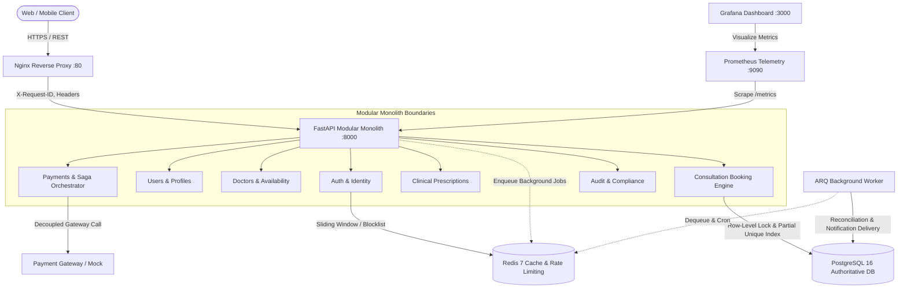

# Architecture & System Design Document

## 1. System Overview & Monolith Boundary

The Amrutam Telemedicine Backend is architected as a **modular monolith** in Python 3.12 and FastAPI. A modular monolith was deliberately chosen over microservices to avoid distributed transaction overhead, network latency, and operational fragmentation while strictly preserving bounded domain boundaries.



### Key Architectural Principles
1. **PostgreSQL is the Sole Authoritative Source of Truth**: All financial, booking, and user lifecycle states exist definitively in relational tables.
2. **Redis as Ephemeral Infrastructure**: Redis manages rate limiting (sliding window sorted sets), JWT JTI revocation blocklists, and ARQ background job queues. Critical business invariants never depend on Redis availability or consistency.
3. **Layered Separation**:
   - `models`: SQLAlchemy 2.0 declarative mappings.
   - `schemas`: Pydantic V2 request validation and response serialization.
   - `repository`: Pure data access layer and raw query isolation.
   - `service`: Domain orchestration, business invariants, Saga compensation, and audit dispatch.
   - `router`: Pure REST transport binding, dependency injection, and HTTP status mapping.

---

## 2. Booking Concurrency & Slot Isolation

Preventing double bookings across concurrent requests is the system's central integrity invariant.

### Multi-Tier Defense Strategy
1. **Pessimistic Concurrency Control (`SELECT ... FOR UPDATE`)**:
   When a patient initiates a booking, the availability slot row is locked using `SELECT * FROM availability_slots WHERE id = :slot_id FOR UPDATE`. Concurrent bookings for the same slot serialize at the database level.
2. **Authoritative Partial Unique Index**:
   ```sql
   CREATE UNIQUE INDEX uq_consultations_slot_active 
   ON consultations (availability_slot_id) 
   WHERE status IN ('SCHEDULED', 'CONFIRMED', 'IN_PROGRESS');
   ```
   Even if application-level locks were bypassed, the database engine prohibits two active consultations for the same slot. Integrity violations immediately trigger a `ConflictException` (HTTP 409).
3. **Idempotency Key Tracking**:
   Client requests submit an `Idempotency-Key` header with a SHA-256 hash verification of the payload:
   - Same key + identical payload $\rightarrow$ returns identical previous response without duplicate reservation.
   - Same key + different payload $\rightarrow$ HTTP 422 Unprocessable Content.

---

## 3. Distributed Transactions & Payment Saga

When processing payments, distributed state transitions are coordinated using the Saga Pattern without distributed two-phase commit (2PC) locks:

1. **Transaction Decoupling**: Database transactions are never held open across external third-party network calls. The payment row is initialized in state `INITIATED` and committed to PostgreSQL prior to initiating the payment provider network request.
2. **Forward Capture**: Upon receiving an approved response (`SUCCESS`), the payment is updated to `SUCCESS` and consultation status transitions to `CONFIRMED`.
3. **Gateway Timeout Handling**:
   - If the payment provider times out, the local transaction catches `TimeoutError`.
   - **Critical Invariant**: The payment remains in state `INITIATED`, and the consultation remains `SCHEDULED` (not falsely confirmed).
   - An ARQ background worker periodically scans for `INITIATED` transactions older than 5 minutes to reconcile with the gateway or mark them `FAILED`.

---

## 4. Partitioning & Archival Strategy

For long-term platform scalability:
- **`audit_logs` Table**: Partitioned by month using PostgreSQL declarative range partitioning (`PARTITION BY RANGE (created_at)`). Older audit partitions can be migrated to read-only cold storage or detached for compliance archiving.
- **`booking_events` Table**: Partitioned by year or migrated to cold analytical object storage (e.g. S3 Parquet) after consultation lifecycle completion.

---

## 5. Backup & Disaster Recovery (DR)

### Operational Targets (Assumptions)
- **Recovery Point Objective (RPO)**: $\le 5\text{ minutes}$ (Continuous WAL archiving).
- **Recovery Time Objective (RTO)**: $\le 30\text{ minutes}$ (Automated container redeployment and point-in-time recovery).

### Backup Procedure
1. **Daily Full Physical Snapshots**: Automated `pg_dump` or `pg_basebackup` nightly at 02:00 UTC.
2. **Continuous WAL Archiving**: Write-Ahead Logging pushed to durable multi-region cloud object storage.
3. **Recovery Verification**: Automated bi-weekly restore drills verifying integrity against mock staging clusters.
