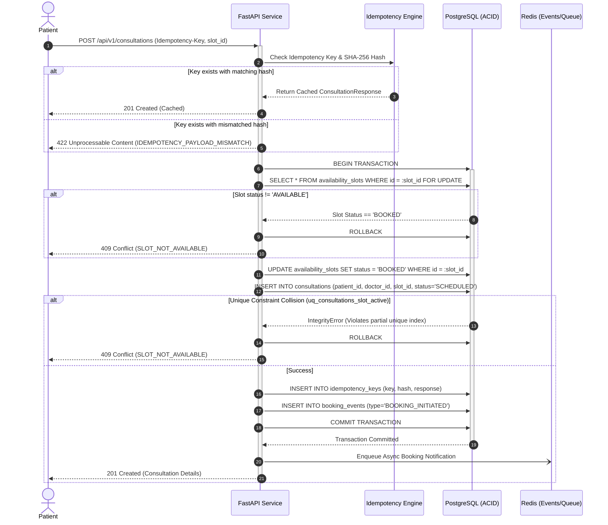
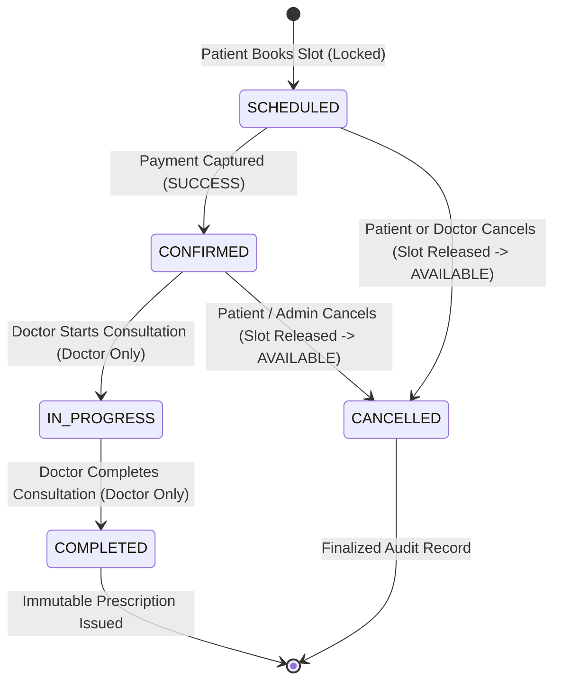

# Consultation Booking & State Machine Sequence

## 1. Booking Sequence with Idempotency & Pessimistic Locking

The diagram below illustrates the exact runtime message flow when a patient books an available slot with race protection and idempotency checking.

---

## 2. Consultation Lifecycle State Machine

Consultations progress strictly through explicit, auditable status transitions.

### Transition Invariants Table

| Initial State | Target State | Permitted Actor | Side Effects |
| :--- | :--- | :--- | :--- |
| `SCHEDULED` | `CONFIRMED` | System / Patient | Payment recorded as `SUCCESS`; booking event emitted. |
| `SCHEDULED` | `CANCELLED` | Patient / Doctor / Admin | Associated `availability_slot` reset to `AVAILABLE`. |
| `CONFIRMED` | `IN_PROGRESS`| Assigned Doctor | Consultation started; clinical timer initiates. |
| `CONFIRMED` | `CANCELLED` | Patient / Admin | Slot released; refund initiated if applicable. |
| `IN_PROGRESS`| `COMPLETED`  | Assigned Doctor | Consultation closed; enables prescription issuance. |
| `COMPLETED`  | Any          | *None* | Terminal state. Prescriptions issued are 100% immutable. |
