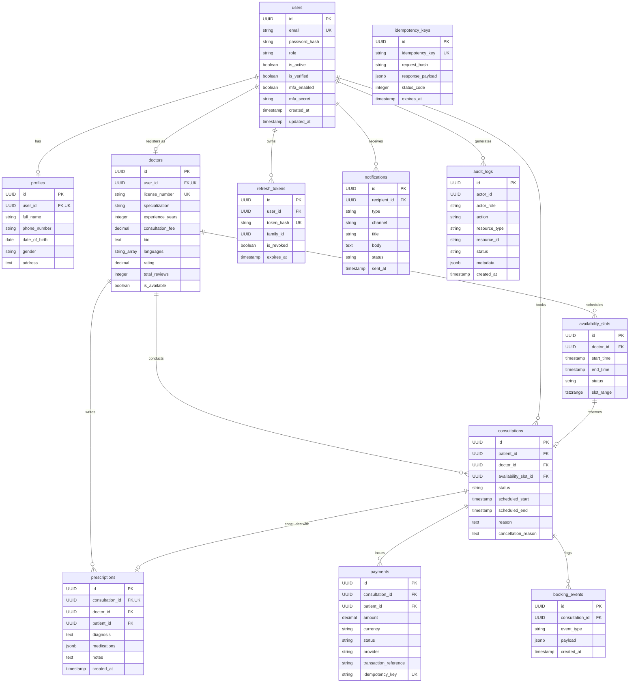

# Database Entity-Relationship (ER) Diagram

The Amrutam Telemedicine schema comprises 12 normalized relational tables designed for strict ACID semantics and complete auditability.

## Key Database Constraints

1. `uq_consultations_slot_active`: Partial unique index guaranteeing only one active consultation (`SCHEDULED`, `CONFIRMED`, `IN_PROGRESS`) can exist per `availability_slot_id`.
2. `uq_prescriptions_consultation`: Unique 1-to-1 constraint preventing multiple prescriptions per consultation.
3. `uq_payments_idempotency_key`: Unique constraint preventing duplicate charges for the same client request key.
4. `uq_doctor_slot_time`: Database composite unique constraint on `(doctor_id, start_time)` combined with application-level transactional range validation (`check_overlap`) preventing overlapping availability intervals.
